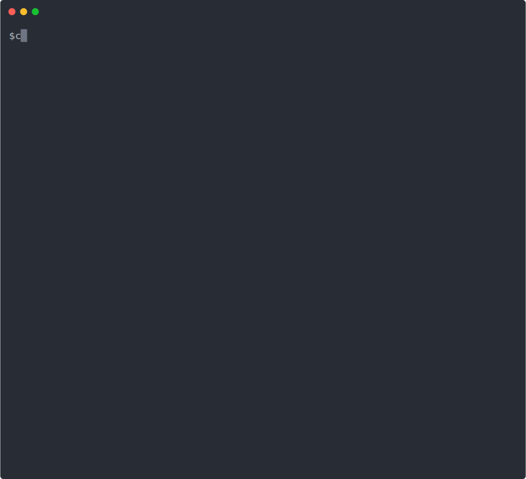

# c-compiler
Simple c compiler & interpreter written in python

## Requirement
- Python3

## Install
#### conda
`$ conda install --file requirements.txt`

#### pip
`$ pip install -r requirements.txt`

## Interpreter
### Usage
`$ python interpreter.py [input .c file path]`

#### Example
`$ python interpreter.py ./sample/base.c`

#### Debugging Mode
`$ python interpreter.py --debug ./sample/base.c`

### CLI

#### next [number]
> Run 'number' of lines

`>> next`

`>> next 100`

#### print [symbol]
> Print stored value of variable

`>> print a`

#### trace [symbol]
> Trace history of variable
>
`>> trace a`

## Optimizer
> Write optimized .c file
### Usage
`$ python interpreter.py [input .c file path]`

#### Example
`$ python optimizer.py ./sample/constant_folding.c ./sample/constant_folding_o.c`

#### Debugging Mode
`$ python optimizer.py --debug ./sample/constant_folding.c ./sample/constant_folding_o.c`

## Features
- Interpreter
    - Recursive Function Call
- Optimizer
    - Constant Folding
    - Dead Code Elimination
